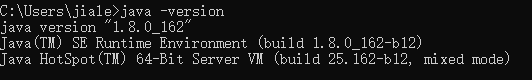
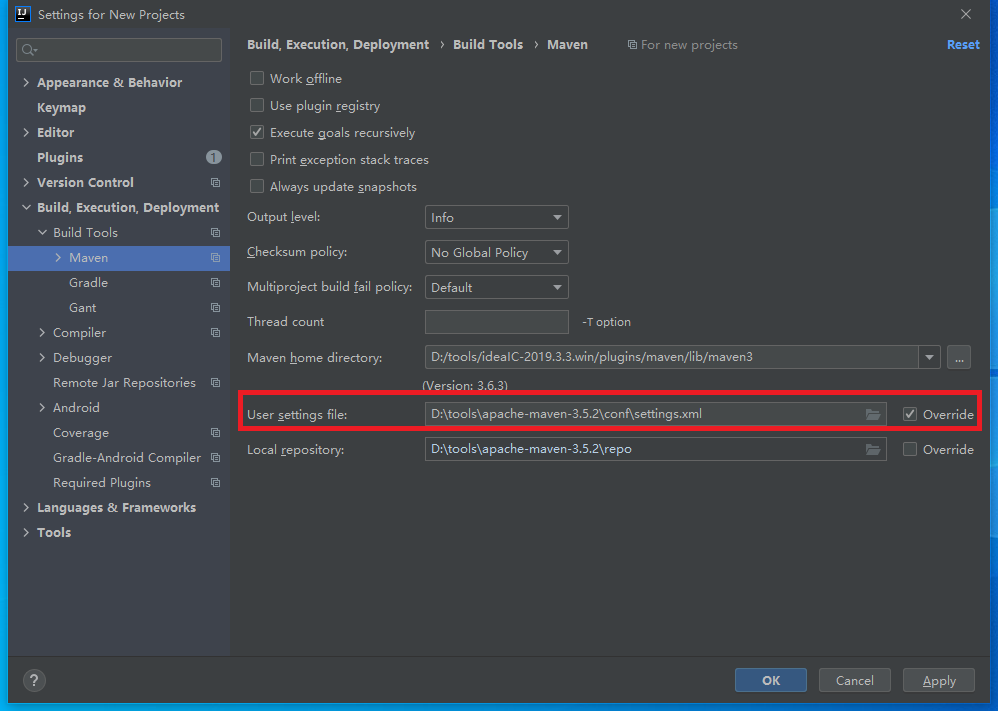
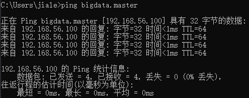

# 大数据Java编程环境

## 背景

大数据软件提供了JAVA API 。我们可以使用java语言调用相关的API，进行HDFS文件、MapReduce、HBase等操作。

## 编程环境搭建

1. 安装JDK

   1. 下载安装包

      https://repo.huaweicloud.com/java/jdk/8u202-b08/

   2. 环境变量

      1. JAVA_HOME      电脑上JDK安装的绝对路径
      2. CLASSPATH      .;%JAVA_HOME%\lib\dt.jar;%JAVA_HOME%\lib\tools.jar;
      3. path                    增加   %JAVA_HOME%\bin

   3. 安装验证

      

2. 安装maven

   1. 下载安装包

      https://repo.huaweicloud.com/apache/maven/maven-3/

   2. 环境变量

      1.  MAVEN_HOME  电脑上MAVEN安装的绝对路径
      2. path        增加 %MAVEN_HOME%\bin

   3. settings.xml 配置镜像仓库

      ```xml
        <mirrors>
          <mirror>
            <id>alimaven</id>
            <name>aliyun maven</name>
            <url>http://maven.aliyun.com/nexus/content/groups/public/</url>
            <mirrorOf>central</mirrorOf>
          </mirror>
        </mirrors>
      ```

   4. 安装验证

      

3. 安装开发工具IDEA Community

   1. 下载安装包 

      https://www.jetbrains.com/idea/download/#section=windows

   2. 使用自己的maven settings.xml

      

4. 下载工程代码

   1. Git基本使用

      https://gitee.com/help

   2. git clone git@gitee.com:niit-cs/introduction-to-big-data.git

   3. 使用maven编译打包

      1. 进入工程根目录

      2. mvn clean

         

      3. mvn package

         

   4. 工程导入到IDEA

      

   

## 相关配置更改

1. hadoop

   1. core-site.xml

      fs.defaultFS的值修改为虚拟机IP
   
      ```xml
      <property>
              <name>fs.defaultFS</name>
              <!--value>hdfs://localhost:9000</value-->
              <value>hdfs://192.168.56.100:9000</value>
      </property>
      ```
   
   2. 启动hadoop，观察hadoop是否正常
   
2. hbase

   1. 删除原先的hbase数据

      1. /home/hadoop/hbase-2.4.1/tmp
      2. hdfs://192.168.56.100:9000/hbase

   2. hbase-site.xml

      hbase.rootdir 使用上面修改后的 fs.defaultFS

      ```xml
      <property>
        <name>hbase.rootdir</name>
        <value>hdfs://192.168.56.100:9000/hbase</value>
      </property>
      ```

   3. linux配置hostname

      需要使用root用户登录

      ```shell
      # 目的：操作hbase时，使用hostname进行通信
      # 编辑 /etc/hosts 如下 ， 添加IP及主机名
      [root@bigdata ~]# cat /etc/hosts
      127.0.0.1   localhost localhost.localdomain localhost4 localhost4.localdomain4
      ::1         localhost localhost.localdomain localhost6 localhost6.localdomain6
      192.168.56.100 bigdata.master
      
      # 编辑 /etc/hostname 如下 ， 设置主机名
      [root@bigdata ~]# cat /etc/hostname
      bigdata.master
      
      [root@bigdata ~]# reboot
      
      [root@bigdata ~]# hostname
      bigdata.master
      ```

   4. 启动hbase

      1. jps命令，查看hbase进程是否正确。如有问题，查看hbase日志去解决。

      2. 检查hbase监控页面的hostname，需要是正确的主机名

         

   5. windows配置hostname

      1. 编辑文件 ‪C:\Windows\System32\drivers\etc\hosts\hosts

         最下方增加一行：192.168.56.100 bigdata.master

         

      2. 验证是否能ping通：

      

## HDFS文件操作

1. API参考文档 https://hadoop.apache.org/docs/stable/api/index.html

2. 代码阅读

3. 执行

4. 练习

   使用JAVA代码，完成之前的HDFS实验操作。

## HBASE操作

1. API参考文档 https://hbase.apache.org/apidocs/index.html

2. 代码阅读

3. 执行

4. 练习

   使用JAVA代码，完成之前的HBASE实验操作。

## MapReduce操作

1. API参考文档 https://hadoop.apache.org/docs/stable/api/index.html

2. 代码阅读

3. 打包

4. 上传

   将打包好的jar包上传到$HADOOP_HOME目录

5. 执行

   参考MapReduce章节的命令

6. 练习

   1. 以WordCount程序结果为样例，构造不少于3个输入文件，形如：

      ```
      Connected  1
      Hadoop  1
      Hello   4
      Map     1
      One     2
      Reduce  1
      dream   1
      world   3
      
      ......
      ```

      分别编写MapReduce代码，计算：

      1. 出现次数最多的单词次数
      2. 出现次数最少的单词次数
      3. 出现次数TOP 10 的单词次数

   2. 求学生每科的平均成绩

      1. 输入格式

         ```
         小明 语文 92
         小明 数学 88
         小明 英语 90
         小强 语文 76
         小强 数学 66
         小强 英语 80
         小木 语文 60
         小木 数学 65
         小木 英语 61
         ```

         

      2. 输出：

         ```
         小明 90
         小强 74
         小木 62
         ```

         

      3. 要求

         自行构造测试用例，不少于3个输入文件

      

   3. 对于两个输入的文件A和B，请编写MapReduce程序，对两个文件进行合并，并删除其中重复的内容，得到一个新的输出文件C
      1. 文件A
         
         ```
         20150101	x
         20150102	y
         20150103	x
         20150104	y
         20150105	z
         20150106	x
         ```
         
      2. 文件B

         ```
         20150101	y
         20150102	y
         20150103	x
         20150104	z
         20150105	y
         ```

         

      3. 根据输入文件A和B合并得到的输出文件C

         ```
         20150101	x
         20150101	y
         20150102	y
         20150103	x
         20150104	y
         20150104	z
         20150105	y
         20150105	z
         20150106	x
         ```

         

## HIVE


## SPARK