# VirtualBox

1. 下载地址

   1. 下载地址： https://download.virtualbox.org/virtualbox/6.1.16/VirtualBox-6.1.16-140961-Win.exe
   2. 主页：https://www.virtualbox.org/

2. 安装指导

   一路next，弹出提示框选“是”

3. 验证安装

   可以打开VirtualBox软件页面即可

# mobaxterm

1. 下载地址： https://dlc2.pconline.com.cn/filedown_1006423_13958251/Yof58SfQ/mobaxterm_v20.5.zip
2. 主页：https://mobaxterm.mobatek.net/

# Linux

1. 下载地址

   1. 下载地址： 
      1. http://mirrors.163.com/centos/8.3.2011/isos/x86_64/CentOS-8.3.2011-x86_64-dvd1.iso
      2. http://mirrors.huaweicloud.com/centos/8.3.2011/isos/x86_64/CentOS-8.3.2011-x86_64-dvd1.iso
      
   2. 主页：https://www.centos.org/

      

2. 进入BIOS开启CPU的虚拟化。

   首先重启电脑，进入BIOS页面。一般按F1、F12或者Del就可以进入。

   然后开启CPU 虚拟化，把Virtualization设置为Enabled状态。

   以联想电脑BIOS为例：

   

   

3. 新建虚拟机

   打开VirtualBox，点击“新建”。

   配置名称、文件夹、类型、版本信息。

   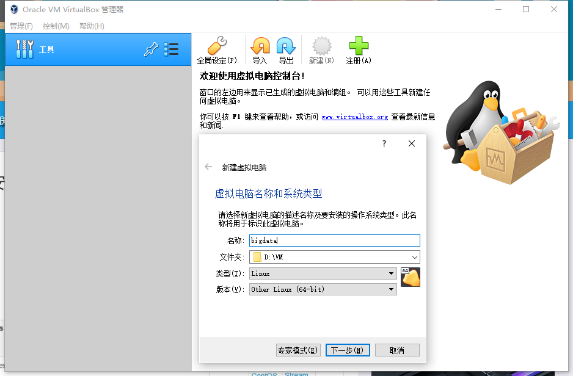

   内存

   

   硬盘

   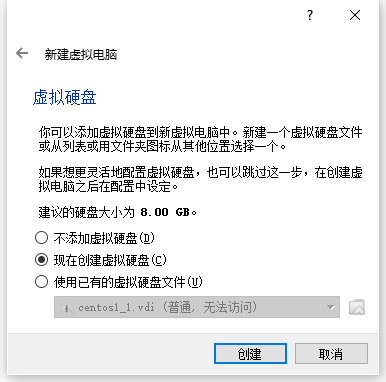

   

   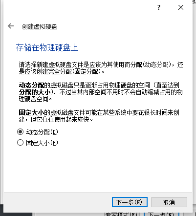

   

4. 安装CentOS

   按照上面的步骤完成后，会返回到如下界面。

   

   打开设置--存储，光驱中选择CentOS安装文件。

   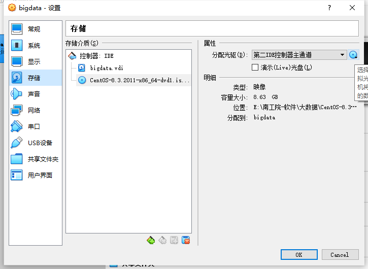

   打开设置--网络，配置网卡1为仅主机（Host-Only）网络（建议，便于和主机通信）

   

   点击OK，配置完毕

   启动虚拟机。启动后，选择第一个 Install 菜单，进入安装流程。

   tips：按右Ctrl键可以切换键鼠的两种状态，即虚拟机模式和真实电脑模式。

   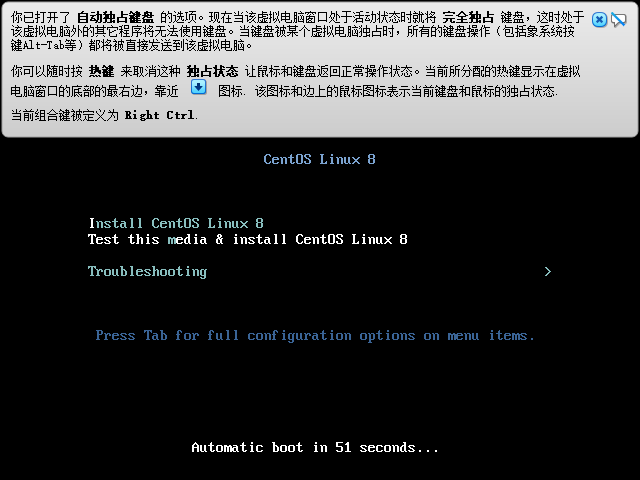

   配置语言：直接Continue

   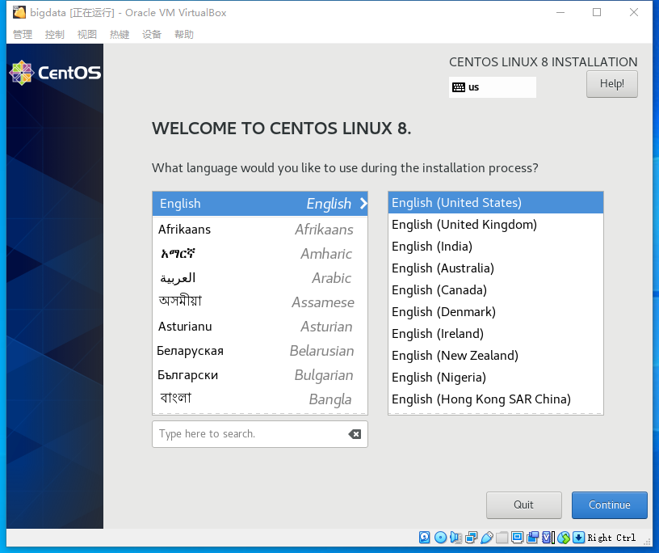

   进行各种配置

   Time & Date：Shanghai

   Software Selection： Server

   Install Destination： Automatic partition

   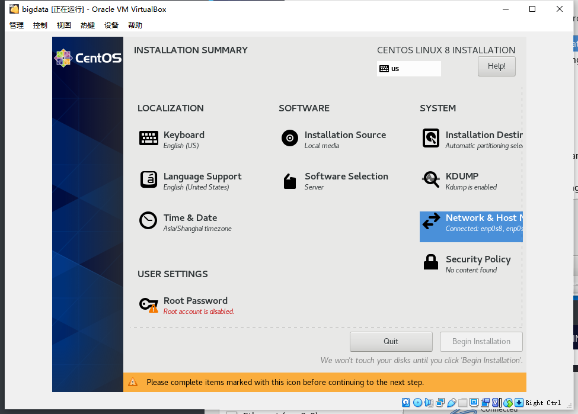

   Network enp0s3： ON   ， 获取到IP

   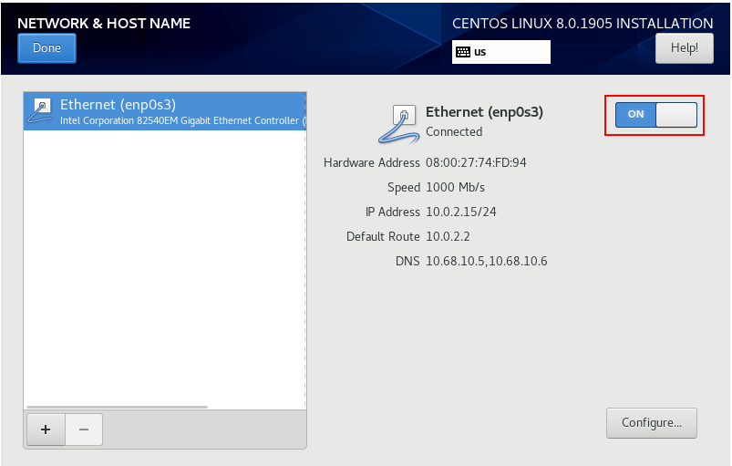

   Root  Password：配置root密码：root 

   User  Creation：创建用户 hadoop， 密码为 hadoop

   系统会有2个用户： root/root， hadoop/hadoop

   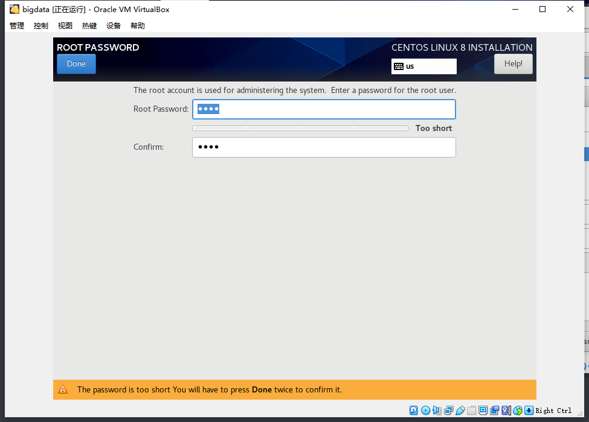

   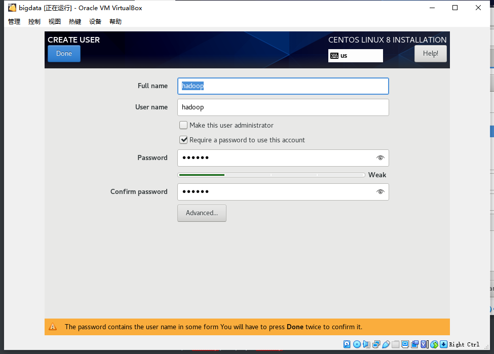

   配置完成后，启动安装： Begin Installation，等待安装完毕，重启。

   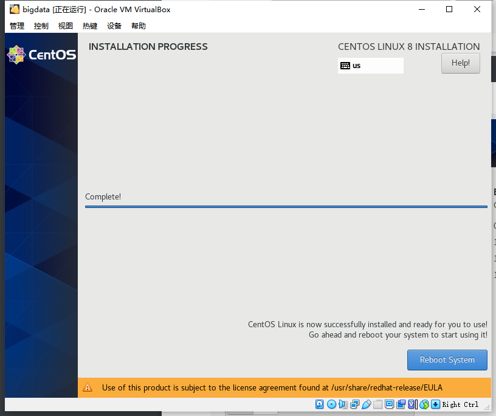

   

5. 验证并配置网络

   使用root用户登录系统

   

   查看网络状态，IP地址信息

   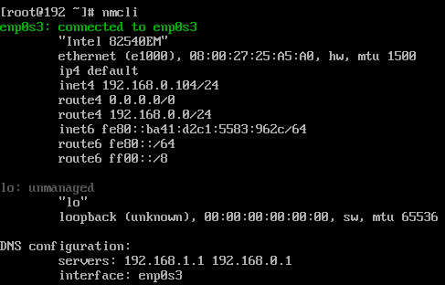

   如果网卡disconnected，使用如下命令连接，附：[CentOS网络管理](./CentOS网络管理.md)

   ```shell
   [root@localhost ~]# nmcli d connect enp0s3
   ```

   查看 /etc/sysconfig/network-scripts/ifcfg-enp0s3 ， 确保如下配置：

   		BOOTPROTO=dhcp
   		ONBOOT=yes

   根据上面查询出来的IP地址，物理机可以ping通虚拟机

   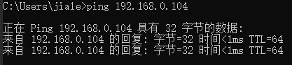

   在物理机上，可以使用MobaXterm登录虚拟机（推荐）

   

   

   关闭并永久禁用防火墙

   ```shell
   [root@192 ~]# systemctl stop firewalld.service
   [root@192 ~]# systemctl  disable  firewalld.service
   [root@192 ~]# systemctl status firewalld.service
   ● firewalld.service - firewalld - dynamic firewall daemon
      Loaded: loaded (/usr/lib/systemd/system/firewalld.service; disabled; vendor preset: enabled)
      Active: inactive (dead)
        Docs: man:firewalld(1)
   
   Feb 25 22:09:53 localhost.localdomain systemd[1]: Starting firewalld - dynamic firewall daemon...
   Feb 25 22:09:58 localhost.localdomain systemd[1]: Started firewalld - dynamic firewall daemon.
   Feb 25 22:09:59 localhost.localdomain firewalld[835]: WARNING: AllowZoneDrifting is enabled. This is considered an insecure configur>
   Feb 25 23:50:17 192.168.0.104 systemd[1]: Stopping firewalld - dynamic firewall daemon...
   Feb 25 23:50:17 192.168.0.104 systemd[1]: firewalld.service: Succeeded.
   Feb 25 23:50:17 192.168.0.104 systemd[1]: Stopped firewalld - dynamic firewall daemon.
   
   ```

   如果之前没有创建hadoop用户，可以使用root用户创建

   ```shell
   [root@instance-9srxppyj ~]# useradd -m hadoop
   ```

   

6. 配置外网连接方法（可选）

   增加第二块网卡，连接方式为NAT

   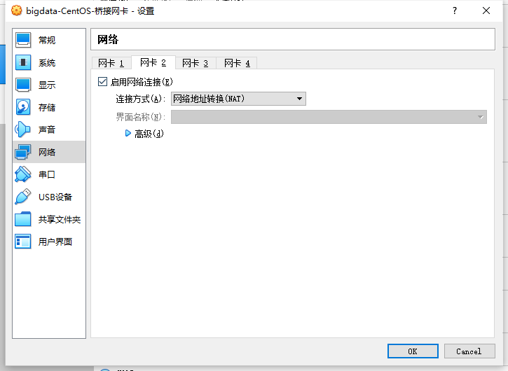

   输入命令 nmcli ，可以看到多了个网卡，但还没连接

   

   连接新网卡

   ```shell
   [root@localhost network-scripts]# nmcli d connect enp0s8
   Device 'enp0s8' successfully activated with '9691ca69-b8f5-42d2-a3c9-19168b44bf9c'.
   ```

   检查网卡配置文件，2个网卡的配置文件都已生成。

   确保2个网卡配置文件里ONBOOT=yes

   enp0s8配置文件中，DEFROUTE=yes，表示此网卡为默认路由

   enp0s3配置文件中，DEFROUTE=no

   ```shell
   [root@localhost network-scripts]# cd /etc/sysconfig/network-scripts
   [root@localhost network-scripts]# ll
   total 8
   -rw-r--r--. 1 root root 282 Feb 28 15:20 ifcfg-enp0s3
   -rw-r--r--. 1 root root 282 Feb 28 16:09 ifcfg-enp0s8
   ```

   虚拟机可以ping通baidu，证明外网可以连接

   ```shell
   # 默认路由走NAT网卡 enp0s8
   [root@10 ~]# route -n
   Kernel IP routing table
   Destination     Gateway         Genmask         Flags Metric Ref    Use Iface
   0.0.0.0         10.0.3.2        0.0.0.0         UG    101    0        0 enp0s8
   10.0.3.0        0.0.0.0         255.255.255.0   U     101    0        0 enp0s8
   192.168.56.0    0.0.0.0         255.255.255.0   U     100    0        0 enp0s3
   
   [root@10 ~]# ping www.baidu.com
   PING www.a.shifen.com (36.152.44.95) 56(84) bytes of data.
   64 bytes from 36.152.44.95 (36.152.44.95): icmp_seq=1 ttl=56 time=6.95 ms
   64 bytes from 36.152.44.95 (36.152.44.95): icmp_seq=2 ttl=56 time=8.79 ms
   ```

   附：[CentOS网络管理](./CentOS网络管理.md)


