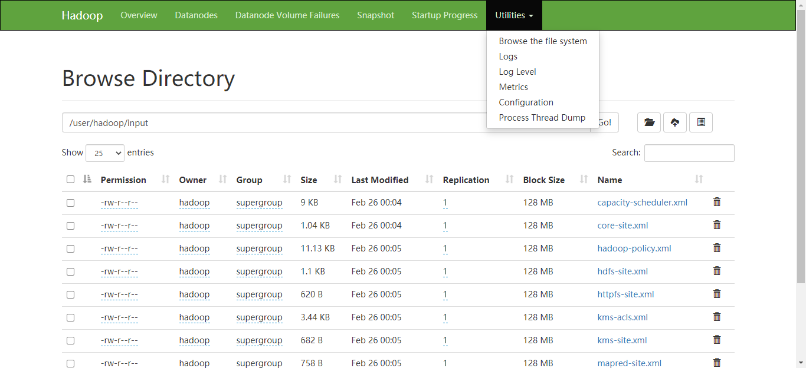

# 配置SSH无密码登陆

使用 hadoop 用户登录CentOS

使用  ssh localhost  发现，需要输入密码：

```shell
[hadoop@192 ~]$ ssh localhost
The authenticity of host 'localhost (::1)' can't be established.
ECDSA key fingerprint is SHA256:1rjqvbF4WxPZLcKHghYkUZ1zFUheZv11EfUDD2pOw1Y.
Are you sure you want to continue connecting (yes/no/[fingerprint])? yes
Warning: Permanently added 'localhost' (ECDSA) to the list of known hosts.
hadoop@localhost's password:
Activate the web console with: systemctl enable --now cockpit.socket

Last login: Thu Feb 25 22:17:07 2021 from 192.168.0.106
[hadoop@192 ~]$ exit
logout
Connection to localhost closed.

```

生成密钥对，配置SSH 无密码验证

```shell
[hadoop@192 ~]$ ssh-keygen -t rsa -P '' -f ~/.ssh/id_rsa
Generating public/private rsa key pair.
Your identification has been saved in /home/hadoop/.ssh/id_rsa.
Your public key has been saved in /home/hadoop/.ssh/id_rsa.pub.
The key fingerprint is:
SHA256:9nyUebieVRnRmNl0/eXXxaT6U2l8Bc+PUIXDmMIJa48 hadoop@192.168.0.104
The key's randomart image is:
+---[RSA 3072]----+
|        .o . +o%B|
|         .+ o.B=X|
|        o  .. .+O|
|       . o   *..@|
|        E . * o=*|
|       . o . +.o.|
|          o o +  |
|           o o . |
|            o    |
+----[SHA256]-----+

[hadoop@192 ~]$ cat ~/.ssh/id_rsa.pub >> ~/.ssh/authorized_keys
[hadoop@192 .ssh]$ chmod 0600 ~/.ssh/authorized_keys
```

此时再用 ssh localhost 命令，无需输入密码就可以直接登陆了

```shell
[hadoop@192 ~]$ ssh localhost
Activate the web console with: systemctl enable --now cockpit.socket

Last login: Thu Feb 25 22:50:00 2021 from 192.168.0.106

```

# Hadoop安装

1. 下载地址

   1. 下载地址： https://mirrors.bfsu.edu.cn/apache/hadoop/common/hadoop-3.2.2/hadoop-3.2.2.tar.gz
   2. 主页：https://hadoop.apache.org/
   3. 参考：https://hadoop.apache.org/docs/stable/hadoop-project-dist/hadoop-common/ClusterSetup.html

2. 安装指导

   使用 hadoop 用户登录CentOS

   上传hadoop安装文件，到/home/hadoop目录

   解压安装文件

   ```shell
   $ tar -xvf hadoop-3.2.2.tar.gz
   ```

   配置环境变量

   ```shell
   # 配置环境变量
   [hadoop@localhost apache-flume-1.9.0-bin]$ vi ~/.bash_profile
   # HADOOP_HOME环境变量，加入到文件最后
   export HADOOP_HOME=/home/hadoop/hadoop-3.2.2

   # 生效环境变量
   [hadoop@localhost apache-flume-1.9.0-bin]$ source ~/.bash_profile
   ```
   
   修改etc/hadoop/hadoop-env.sh
   
   ```shell
   [hadoop@192 ~]$ cd ~/hadoop-3.2.2/
   [hadoop@192 hadoop-3.2.2]$ vi etc/hadoop/hadoop-env.sh
   # 编辑如下信息
   export JAVA_HOME=/home/hadoop/jdk1.8.0_202/
   ```

尝试执行hadoop命令，会打印出帮助信息

   ```shell
   [hadoop@192 ~]$ bin/hadoop
Usage: hadoop [OPTIONS] SUBCOMMAND [SUBCOMMAND OPTIONS]
    or    hadoop [OPTIONS] CLASSNAME [CLASSNAME OPTIONS]
     where CLASSNAME is a user-provided Java class
   
     OPTIONS is none or any of:
   ```

   Hadoop 安装有如下三种方式：

1. 单机模式：安装简单，几乎不用做任何配置，但仅限于调试用途。
   
   例如如下命令：查找etc/hadoop/*.xml中，符合正则表达式的内容
   
   ```shell
      [hadoop@192 ~]$ cd ~/hadoop-3.2.2/
   [hadoop@192 hadoop-3.2.2]$ mkdir input
      [hadoop@192 hadoop-3.2.2]$ cp etc/hadoop/*.xml input
   [hadoop@192 hadoop-3.2.2]$ bin/hadoop jar share/hadoop/mapreduce/hadoop-mapreduce-examples-3.2.2.jar grep input output 'dfs[a-z.]+'
      [hadoop@192 hadoop-3.2.2]$ cat output/*
      
   ```
   
   2. 完全分布式模式：正常的 Hadoop 集群，由多个各司其职的节点构成。
   
      
   
   3. 伪分布模式：在单节点上同时启动 NameNode、DataNode、JobTracker、TaskTracker、Secondary Namenode 等 5 个进程，模拟分布式运行的各个节点。
   
      1. 修改配置文件
   
         ```shell
         [hadoop@192 ~]$ cd ~/hadoop-3.2.2/
         
         # 修改： etc/hadoop/core-site.xml
         <configuration>
             <property>
                 <name>hadoop.tmp.dir</name>
                 <value>file:/home/hadoop/tmp</value>
                 <description>Abase for other temporary directories.</description>
             </property>
             <property>
                 <name>fs.defaultFS</name>
                 <value>hdfs://localhost:9000</value>
             </property>
         </configuration>
         
         # 修改： etc/hadoop/hdfs-site.xml
         <configuration>
             <property>
                 <name>dfs.replication</name>
                 <value>1</value>
          </property>
             <property>
              <name>dfs.namenode.name.dir</name>
                 <value>file:/home/hadoop/tmp/dfs/name</value>
             </property>
             <property>
                 <name>dfs.datanode.data.dir</name>
                 <value>file:/home/hadoop/tmp/dfs/data</value>
             </property>
         </configuration>
         
         ```
   
      2. 格式化文件系统，提示 successfully formatted
   
         ```shell
         [hadoop@192 hadoop-3.2.2]$ bin/hdfs namenode -format
         WARNING: /home/hadoop/hadoop-3.2.2/logs does not exist. Creating.
         2021-02-25 23:29:53,190 INFO namenode.NameNode: STARTUP_MSG:
         /************************************************************
         STARTUP_MSG: Starting NameNode
         STARTUP_MSG:   host = 192.168.0.104/192.168.0.104
         STARTUP_MSG:   args = [-format]
         STARTUP_MSG:   version = 3.2.2
      。。。
         2021-02-25 23:29:57,437 INFO common.Storage: Storage directory /home/hadoop/tmp/dfs/name has been successfully formatted.
      2021-02-25 23:29:57,517 INFO namenode.FSImageFormatProtobuf: Saving image file /home/hadoop/tmp/dfs/name/current/fsimage.ckpt_0000000000000000000 using no compression
         2021-02-25 23:29:57,730 INFO namenode.FSImageFormatProtobuf: Image file /home/hadoop/tmp/dfs/name/current/fsimage.ckpt_0000000000000000000 of size 401 bytes saved in 0 seconds .
         2021-02-25 23:29:57,761 INFO namenode.NNStorageRetentionManager: Going to retain 1 images with txid >= 0
         2021-02-25 23:29:57,771 INFO namenode.FSImage: FSImageSaver clean checkpoint: txid=0 when meet shutdown.
         2021-02-25 23:29:57,773 INFO namenode.NameNode: SHUTDOWN_MSG:
         /************************************************************
         SHUTDOWN_MSG: Shutting down NameNode at 192.168.0.104/192.168.0.104
      ************************************************************/
         
         ```
      ```
      
      ```
   
   3. 开启 NameNode 和 DataNode 守护进程
   
      ```shell
         [hadoop@192 hadoop-3.2.2]$ sbin/start-dfs.sh
         Starting namenodes on [localhost]
         Starting datanodes
         Starting secondary namenodes [192.168.0.104]
      ```
   
         成功启动后，可以访问 Web 界面 http://IP:9870 查看 NameNode 和 Datanode 信息，还可以在线查看 HDFS 中的文件。
   
         
   
      4. 运行Hadoop伪分布式实例
   
         ```shell
         # Hadoop系统安装好以后，第一次使用HDFS时，需要首先在HDFS中创建用户目录。
         # 在HDFS中为hadoop用户创建一个用户目录
         [hadoop@192 hadoop-3.2.2]$ bin/hdfs dfs -mkdir -p /user/hadoop
         
         # 将 /usr/local/hadoop/etc/hadoop 复制到分布式文件系统中的 /user/hadoop/input 中
         [hadoop@192 hadoop-3.2.2]$ bin/hdfs dfs -mkdir input
         [hadoop@192 hadoop-3.2.2]$ bin/hdfs dfs -put etc/hadoop/*.xml input
         [hadoop@192 hadoop-3.2.2]$ bin/hdfs dfs -ls input
         
         # 伪分布式运行 MapReduce 作业
         # 伪分布式读取的是HDFS中的文件
         [hadoop@192 hadoop-3.2.2]$ bin/hadoop jar share/hadoop/mapreduce/hadoop-mapreduce-examples-3.2.2.jar grep input output 'dfs[a-z.]+'
         
         # 查看结果
         [hadoop@192 hadoop-3.2.2]$ bin/hdfs dfs -cat output/*
         1       dfsadmin
         1       dfs.replication
         1       dfs.namenode.name.dir
         1       dfs.datanode.data.dir
         
         # 结果取回本地
         # 先删除本地的 output 文件夹（如果存在）
         [hadoop@localhost hadoop-3.2.2]$ rm -r ./output
         # 将 HDFS 上的 output 文件夹拷贝到本机
         [hadoop@localhost hadoop-3.2.2]$ ./bin/hdfs dfs -get output ./output
         # 查看结果
         [hadoop@localhost hadoop-3.2.2]$ cat ./output/*
         1       dfsadmin
         1       dfs.replication
         1       dfs.namenode.name.dir
         1       dfs.datanode.data.dir
         
         # Hadoop 运行程序时，输出目录不能存在，需要执行如下命令删除 hdfs output 文件夹
         [hadoop@localhost hadoop-3.2.2]$ ./bin/hdfs dfs -rm -r output
         Deleted output
         
         # 关闭 Hadoop
         [hadoop@localhost hadoop-3.2.2]$ ./sbin/stop-dfs.sh
         Stopping namenodes on [localhost]
         Stopping datanodes
         Stopping secondary namenodes [localhost.localdomain]
         
         ```
