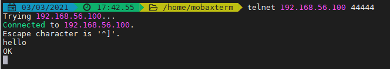

# Flume

1. 下载地址
   1. 下载地址： https://mirrors.tuna.tsinghua.edu.cn/apache/flume/1.9.0/apache-flume-1.9.0-bin.tar.gz
   2. 主页：http://flume.apache.org/index.html
   
3. 参考：
      1. https://cwiki.apache.org/confluence/display/FLUME/Getting+Started
      2. http://flume.apache.org/releases/content/1.9.0/FlumeUserGuide.html#
      3. http://flume.apache.org/releases/content/1.9.0/FlumeUserGuide.html#hdfs-sink
   
2. 安装

   使用 hadoop 用户登录CentOS
   
   上传安装文件，到/home/hadoop目录
   
   ```shell
   # 解压安装文件
   [hadoop@10 ~]$ tar -xvf apache-flume-1.9.0-bin.tar.gz
   
   # cd到软件目录观察
   [hadoop@10 apache-flume-1.9.0-bin]$ cd /home/hadoop/apache-flume-1.9.0-bin
   [hadoop@10 apache-flume-1.9.0-bin]$ ll
   total 168
   drwxr-xr-x.  2 hadoop hadoop    62 Mar  3 09:59 bin
   -rw-rw-r--.  1 hadoop hadoop 85602 Nov 29  2018 CHANGELOG
   drwxr-xr-x.  2 hadoop hadoop   127 Mar  3 12:47 conf
   -rw-r--r--.  1 hadoop hadoop  5681 Nov 16  2017 DEVNOTES
   -rw-r--r--.  1 hadoop hadoop  2873 Nov 16  2017 doap_Flume.rdf
   drwxrwxr-x. 12 hadoop hadoop  4096 Dec 18  2018 docs
   drwxrwxr-x.  2 hadoop hadoop  8192 Mar  3 09:59 lib
   -rw-rw-r--.  1 hadoop hadoop 43405 Dec 10  2018 LICENSE
   -rw-r--r--.  1 hadoop hadoop   249 Nov 29  2018 NOTICE
   -rw-r--r--.  1 hadoop hadoop  2483 Nov 16  2017 README.md
   -rw-rw-r--.  1 hadoop hadoop  1958 Dec 10  2018 RELEASE-NOTES
   drwxrwxr-x.  2 hadoop hadoop    68 Mar  3 09:59 tools
   
   # 观察Flume命令使用方法
   [hadoop@10 apache-flume-1.9.0-bin]$ bin/flume-ng
   
   ```
   
3. 实验内容：helloworld

   ```shell
   # 编辑配置文件
   [hadoop@10 apache-flume-1.9.0-bin]$ vi conf/example.conf
   #========================================================= example.conf START ========================
   # example.conf: A single-node Flume configuration
   
   # Name the components on this agent
   a1.sources = r1
   a1.sinks = k1
   a1.channels = c1
   
   # Describe/configure the source
   a1.sources.r1.type = netcat
   a1.sources.r1.bind = 0.0.0.0
   a1.sources.r1.port = 44444
   
   # Describe the sink
   a1.sinks.k1.type = logger
   
   # Use a channel which buffers events in memory
   a1.channels.c1.type = memory
   a1.channels.c1.capacity = 1000
   a1.channels.c1.transactionCapacity = 100
   
   # Bind the source and sink to the channel
   a1.sources.r1.channels = c1
   a1.sinks.k1.channel = c1
   #========================================================= example.conf END ========================
   
   # 启动
   [hadoop@10 apache-flume-1.9.0-bin]$ bin/flume-ng agent --conf conf --conf-file conf/example.conf --name a1 -Dflume.root.logger=INFO,console
   
   ```

   再打开一个本地终端：Start local terminal

   

   telnet到虚拟机44444端口，输入hello

   

   在原来的终端上查看，可以收到来自于 `telnet` 发出的消息

   ```shell
   2021-03-03 16:14:39,412 (SinkRunner-PollingRunner-DefaultSinkProcessor) [INFO - org.apache.flume.sink.LoggerSink.process(LoggerSink.java:95)] Event: { headers:{} body: 68 65 6C 6C 6F 0D                               hello. }
   
   ```

4. 实验内容：收集日志到 HDFS

   前提条件：HDFS处于启动状态

   首先编辑配置文件

   ```shell
   [hadoop@localhost apache-flume-1.9.0-bin]$ vi conf/flume-hdfs.conf
   
   # Name the components on this agent
   a1.sources = r1
   a1.sinks = k1
   a1.channels = c1
   
   # Describe/configure the source
   a1.sources.r1.type = exec
   a1.sources.r1.command = tail -f /home/hadoop/hadoop-3.2.2/logs/hadoop-hadoop-namenode-localhost.localdomain.log
   
   # Describe the sink
   a1.sinks.k1.type = hdfs
   a1.sinks.k1.hdfs.path = hdfs://localhost:9000/flume/data
   a1.sinks.k1.hdfs.filePrefix = events-
   a1.sinks.k1.hdfs.round = true
   a1.sinks.k1.hdfs.roundValue = 60
   a1.sinks.k1.hdfs.roundUnit = minute
   a1.sinks.k1.hdfs.rollSize = 4000000
   a1.sinks.k1.hdfs.rollCount = 0
   
   # Use a channel which buffers events in memory
   a1.channels.c1.type = memory
   a1.channels.c1.capacity = 1000
   a1.channels.c1.transactionCapacity = 100
   
   # Bind the source and sink to the channel
   a1.sources.r1.channels = c1
   a1.sinks.k1.channel = c1
   ```

   配置环境变量，启动

   ```shell
   # 配置环境变量
   [hadoop@localhost apache-flume-1.9.0-bin]$ vi ~/.bash_profile
   # HADOOP_HOME环境变量，加入到文件最后
   export HADOOP_HOME=/home/hadoop/hadoop-3.2.2
   
   # 生效环境变量
   [hadoop@localhost apache-flume-1.9.0-bin]$ source ~/.bash_profile
   
   # flume自带的guava版本过低，备份
   [hadoop@localhost apache-flume-1.9.0-bin]$ mv  lib/guava-11.0.2.jar lib/guava-11.0.2.jar.bak
   # 启动
   [hadoop@localhost apache-flume-1.9.0-bin]$ bin/flume-ng agent --conf conf --conf-file conf/flume-hdfs.conf --name a1 -Dflume.root.logger=INFO,console
   ```

   观察hdfs上文件的变化

   ```shell
   [hadoop@localhost apache-flume-1.9.0-bin]$ ~/hadoop-3.2.2/bin/hadoop fs -ls /
   Found 2 items
   drwxr-xr-x   - hadoop supergroup          0 2021-03-04 14:40 /flume
   drwxr-xr-x   - hadoop supergroup          0 2021-02-26 00:03 /user
   [hadoop@localhost apache-flume-1.9.0-bin]$ ~/hadoop-3.2.2/bin/hadoop fs -cat /flume/data/*
   
   ```

6. 练习

      1. 编写shell脚本，模拟日志的生成。要求：每隔1s写入一行日志到日志文件，日志内容包括 行号、当前时间等，可自行设计。参考：

            

      2. Channel配置

            根据flume官方文档，配置 Memory Channel。

      3. Source配置1

            使用生成的日志文件为数据源。

            根据flume官方文档，配置 Exec Source。

            根据flume官方文档，分别配置如下Sink，启动agent，测试并观察效果。

            1. Logger Sink
            2. Avro Sink
            3. File Roll Sink

      4. Source配置2

            使用生成的日志文件为数据源，根据flume官方文档，配置Spooling Directory Source。

            使用此source，重复第3步的实验。

            

            
